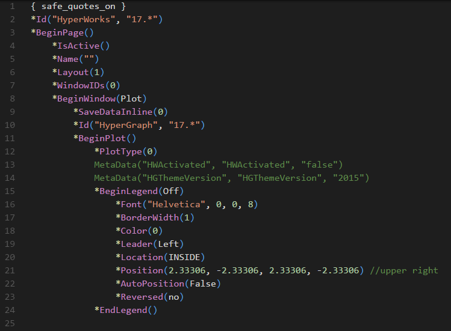

# HyperWorks Session Files for VSCode

## What is a Session File
A session file is a text file that contains a structured list of statements.  The statements include instructions for page layout and window content, such as graphic and plot information.  A session file is generated whenever you save a work session.  Session files can also be created outside of the program using any text editor or generated from other applications.

Session files have the MVW default extension.

Session files can be opened in **HyperView**, **MotionView**, **HyperGraph**, **HyperGraph 3D**, **TextView** and **MediaView**.

If you are reading files that are on a different drive than where the session file is saved, **HyperWorks Desktop** saves the full path.
If the session file is saved on the same drive as the files being read, **HyperWorks Desktop** saves relative path.
If the session file is saved in the same directory as the file, it saves no path.

## Features

### Syntax highlighting

